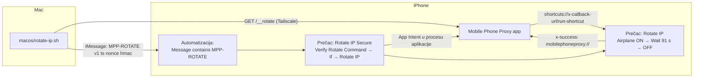
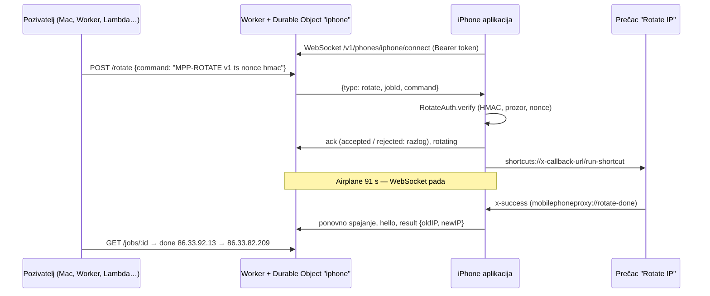

# Rotacija mobilne IP adrese na iOS-u (2026-10-01)

Cilj: s Maca (ili bilo kojeg servisa) na zahtjev dobiti **novu javnu IP adresu**
iPhonea koji radi kao proxy. Mreža je Telemach HR mobilna, AS205714. Telefon je
iPhone 15 Pro s iOS 26.4.2, a Mac ga dohvaća preko Tailscalea (`100.71.146.11:8888`).

## Sažetak

| Što | Stanje |
|---|---|
| Airplane mode ≥ ~64 s → nova javna IP | ✅ 7/7 (od toga 5/5 sa 91 s) |
| Airplane mode ≤ 61 s → ista IP | ✅ 4/4 (20, 32, 61, 61 s) |
| Okidač s Maca: `GET /__rotate` → Prečaci po URL-u | ✅ 4/4, ali **samo kad je aplikacija u prvom planu i nije uključen kiosk način** |
| Okidač s Maca: potpisani iMessage → automatizacija → App Intent | ✅ izvan Assistive Accessa; ❌ **u Assistive Accessu App Intent se ne pokrene** (0/3, poruke isporučene) |
| **Relay** (Cloudflare Worker + WebSocket) → aplikacija → Prečaci po URL-u | ✅ 2/2 (97 s i 110 s), bez Tailscalea; aplikacija mora biti u prvom planu, bez kiosk načina. ❌ u Assistive Accessu: iOS odbija `shortcuts://` (19:05:41) |
| Guided Access | ❌ blokira otvaranje Prečaca |
| Assistive Access | ✅ vremenska automatizacija i iMessage `MPP-TEST` (bez App Intenta) rade |

## Dvije IP adrese: privatna i javna (CGNAT)

Aplikacija na sučelju `pdp_ip0` vidi samo **privatnu adresu operatera**
(10.x.x.x). Javna adresa (86.33.x.x) nastaje tek na Telemachovom CGNAT-u i
vidi se samo izvana. Zato aplikacija javnu adresu dohvaća sama
(`PublicIP.swift`, `api.ipify.org` preko socketa vezanog na mobilno sučelje).

Kad se javna adresa promijenila, promijenila se i privatna. Kad je ostala
ista, ostala je i privatna. Operater, dakle, nakon kratkog prekida vraća istu
PDP sesiju.

## Mjerenja: koliko dugo Airplane mode

| Prekid | Način | Javna IP prije → poslije |
|---|---|---|
| ~20 s | ručno | ista |
| ~32 s | ručno | ista |
| 61 s | prečac | `86.33.88.39` → ista |
| ~64 s | ručno | `86.33.83.7` → `86.33.95.153` |
| >77 s | ručno | `86.33.87.19` → `86.33.83.7` |
| 91 s | prečac | `86.33.88.39` → `86.33.82.230` |
| 91 s | prečac | `86.33.82.230` → `86.33.86.151` |
| 91 s | prečac | `86.33.86.151` → `86.33.86.62` |
| 91 s | prečac | `86.33.86.62` → `86.33.90.207` |
| 91 s | prečac | `86.33.90.207` → `86.33.82.18` |

Granica je između 61 i ~64 s. **91 s je radna vrijednost**: s Maca jedna
rotacija traje oko 97 s, a preko iMessagea oko 105–112 s.

## Arhitektura okidača

### A) URL okidač (`/__rotate`)

- Aplikacija može otvoriti drugu aplikaciju **samo dok je u prvom planu**.
  Inače `/__rotate` vraća 409.
- **Guided Access** to blokira (test: `rotation aborted`). Opasnosti nema:
  Airplane mode se ne upali i telefon ostaje dostupan.
- U **Assistive Access** se aplikacija **Prečaci ne može dodati** (nema je na
  popisu), pa ovaj put tamo ne postoji.

### B) Potpisani iMessage

Format: `MPP-ROTATE v1 <unix-ts> <nonce> <hex HMAC-SHA256(secret, "MPP-ROTATE|v1|ts|nonce")>`

- Prečaci ne znaju računati HMAC, pa provjeru radi App Intent **Verify Rotate
  Command** (`VerifyRotateCommandIntent.swift`, `RotateAuth.swift`). Provjera
  usporedbom u konstantnom vremenu, prozor od 300 s plus 60 s pomaka sata,
  jednokratni nonce (troši se tek nakon ispravnog potpisa).
- Ključ: `GET /__pair` samo u 2-minutnom prozoru koji se otvara tipkom „Pair
  Mac" u aplikaciji. Na iOS-u je u Keychainu (`AfterFirstUnlockThisDeviceOnly`),
  na Macu u login keychainu (service `mobile-phone-proxy-rotate`). Ključ je
  **preživio brisanje i ponovnu instalaciju aplikacije**.
- Okidač „Message contains" reagira i na poruku s **istog Apple ID-a**, pa
  drugi račun ne treba. Kašnjenje od slanja do pada mreže bilo je 16–54 s.
- Mac šalje preko `osascript` → Messages. Mac čita poslane poruke iz
  `~/Library/Messages/chat.db` (tekst je u `attributedBody`), što je korisno
  za provjeru je li poruka isporučena.

## Zamke koje su koštale vremena

1. **Akcija iz aplikacije se ne pojavljuje u Prečacima** dok se ne promijeni
   `CFBundleVersion`. Svi raniji buildovi imali su `1`. Sada `project.yml`
   koristi `MARKETING_VERSION`/`CURRENT_PROJECT_VERSION`, a za svaki build za
   uređaj treba povećati `CURRENT_PROJECT_VERSION`. Uz to postoji i
   `AppShortcutsProvider`. Na kraju je trebalo i obrisati pa ponovno
   instalirati aplikaciju.
2. **App Intent se vidi u Prečacima, ali ne i u uredniku automatizacija.**
   Zaobilazno rješenje je običan prečac „Rotate IP Secure" koji automatizacija
   pokreće s ulazom Shortcut Input.
3. **„Prečac pokreće drugi prečac" traži jednokratnu potvrdu.** Prva prava
   iMessage rotacija je tiho zapela na tom upitu. Nakon „Always Allow" radi bez
   dodira.
4. **`handle` je rezervirana riječ** u AppleScript rječniku aplikacije
   Messages: `on run {handle, …}` puca s `Can't get handle (-1728)`.
5. **Origin-form zahtjev** (`GET /__rotate` bez apsolutnog URI-ja) se prije
   proslijeđivao natrag samom proxyju. Sada ga aplikacija obrađuje lokalno.
6. **Instalacija preko Tailscalea nije moguća**: CoreDevice/devicectl traži
   Bonjour na istoj mreži, a RoamRun i iphone-tailnet-bridge trebaju prvo
   uparivanje na istoj mreži. Radi **Ad Hoc** (tim `6SCK58757K` je plaćeni, a
   UDID telefona je u profilu) preko privremenog `cloudflared` quick tunela s
   `itms-services` manifestom. Link se telefonu može poslati iMessageom.
   **Za lokalni HTTP server uvijek uzmi provjereno slobodan port**: port 8765
   je bio zauzet tuđim CRM UI-jem, koji je zato ~1–2 min bio javno izložen.
7. Jedna neuspjela provjera (zastoj DERP relaya) nije Airplane mode.
   `rotate-ip.sh` sada traži dvije neuspjele provjere zaredom.

## Odbačeno

- **Privatni API `RadiosPreferences.setAirplaneMode:`**: treba Appleov privatni
  entitlement koji se ne može dobiti ni u Ad Hoc ni u Enterprise profilu.
  Ostaje samo jailbreak ili TrollStore, a ni jedno ni drugo ne postoji za iOS 26.
- **Guided Access kao kiosk**: blokira otvaranje Prečaca.
- **Single App Mode**: traži nadzirani uređaj (MDM), dakle reset telefona.

## Relay (Cloudflare Worker)

Bilo koji servis u oblaku može zatražiti rotaciju, bez Tailscalea i bez
iMessagea. Kod je u `relay/`, a deployan je na
`https://mpp-relay.d-o-m.workers.dev` (Cloudflare račun D.O.M.).

- **Relay nije točka povjerenja.** Prosljeđuje istu potpisanu naredbu kao
  iMessage put, a HMAC provjerava samo telefon. Relay provjerava samo oblik i
  svježinu naredbe (±300 s) da rano odbaci smeće.
- **Telefon se prijavljuje tokenom** `HMAC(tajna, "MPP-RELAY|v1|<phoneId>")`.
  Izvodi se iz već uparene tajne, pa na telefonu ništa novo ne treba. Mac ga
  ispisuje s `rotate-ip.sh --relay-token`, a u Workeru je u secretu
  `PHONE_TOKENS` (JSON `{"iphone": "…", "sim": "…"}`). Sandučić postoji samo za
  ID-jeve iz tog secreta, a ostali dobiju 404.
- **Keepalive:** aplikacija svakih 25 s šalje tekst `ping`. Durable Object
  odgovara `pong` automatski (`setWebSocketAutoResponse`), bez buđenja. Ako
  `pong` izostane 70 s, aplikacija se ponovno spaja. Backoff je najviše 15 s,
  a nova adresa na mobilnoj mreži odmah pokreće ponovno spajanje.
- **Poslovi:** odjednom se izvodi jedan (inače 409). Dok je telefon offline,
  posao čeka u redu, a nakon 6 min proglašava se neuspjelim. Stanja su
  `queued → sent → accepted|rejected → rotating → done|failed`.
- **Ograničenje ostaje:** aplikacija mora biti u prvom planu i ne smije biti u
  Guided ni Assistive Accessu. Inače posao odmah završi kao `failed` s
  razlogom „app is not in the foreground”.

Korištenje s Maca: `macos/rotate-ip.sh --relay` (izlazni kodovi isti kao kod
ostalih načina). Iz drugog servisa: složi naredbu kao `--sign` (tajna je
potrebna), napravi `POST /v1/phones/iphone/rotate`, pa prati
`GET /v1/phones/iphone/jobs/<jobId>`.

Testovi:
- `relay/test/smoke.mjs` s `wrangler dev` glumi i telefon i pozivatelja.
- Simulator se spaja kao `sim` (build postavka `MPP_RELAY_PHONE_ID=sim`).
  Zbog `simctl openurl` upita povratak iz prečaca glumi `/__callback/rotate-done`,
  hook koji postoji samo u simulatoru.

## Dijagnostika: `/__log`

`GET /__log` vraća log aplikacije (`lines`) i trajni zapis svakog pokretanja
„Verify Rotate Command” (`intentEvents`, u `UserDefaults`, preživljava novi
proces). `rotate-ip.sh --imessage` ga čita 60 s nakon slanja. Ako se intent
nije pokrenuo, šalje poruku ponovno (najviše 3 slanja). Ako ga je intent
odbio, staje. Ako ga je prihvatio, zastoj je u lancu prečaca.

Tako je utvrđeno da se **u Assistive Accessu App Intent uopće ne pokrene**:
tri isporučene potpisane poruke u 18:08–18:10, a `intentEvents` je ostao
prazan. Korisnik je odlučio da kiosk način nije nužan, pa je to ostavljeno.

## Otvoreno

- **Relay u Assistive Accessu ne radi** (test 19:05): naredba prihvaćena, ali
  `Rotate failed: iOS refused to open Shortcuts`. Telefon je ostao online.
  Build 5 (commitan, nije instaliran) tada odmah javlja `failed` relayu umjesto
  da posao čeka 6 min. Ako kiosk zatreba, kandidati za „zvono" koje
  automatizacija vidi: (A) automatizacija „App is Closed", a aplikacija se
  zatvori samo na provjerenu naredbu; (B) Mac šalje iMessage, a prečac preko
  `Get Contents of URL http://127.0.0.1:8888/…` pita aplikaciju čeka li
  provjerena naredba. Oboje netestirano.
- **Flota telefona**: plan u `2026-10-01-relay-fleet-design.md`.
- **Android** to može bez ovih zaobilaznica: Shizuku (ovlasti na razini ADB-a,
  bez roota) → `cmd connectivity airplane-mode enable/disable` iz same
  aplikacije, a kiosk se dobije pinanjem ekrana. Na uređaju još nije isprobano.

## Vezani dokumenti

- `README.md` → *Remote (phone not on your WiFi)*
- `macos/rotate-ip.sh` (`--help`)
- `relay/README.md`
