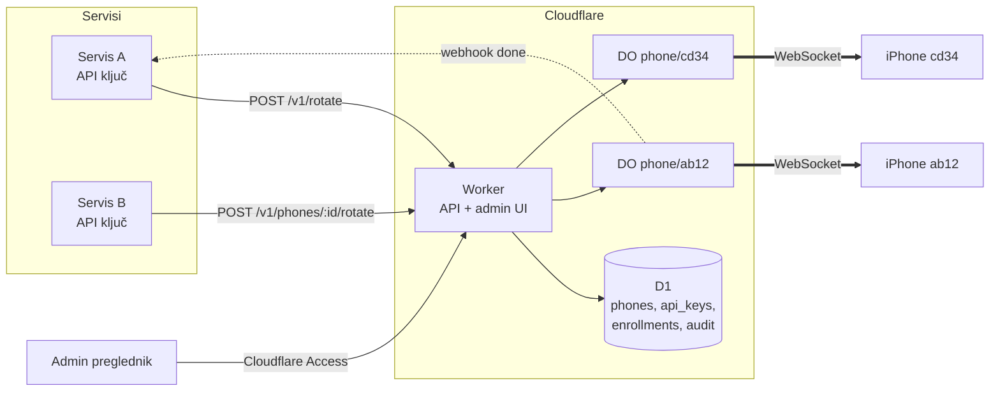
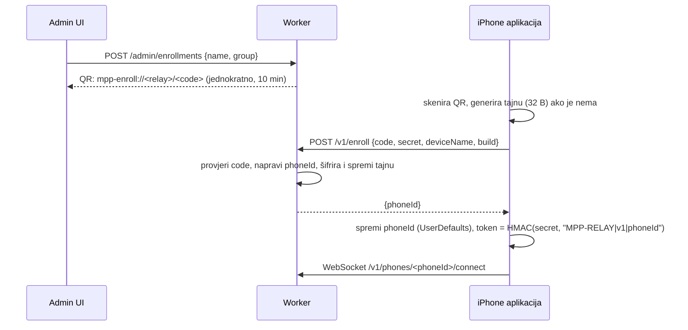

# Relay za flotu telefona — dizajn i plan (2026-10-01)

**Status: samo plan, ništa od ovoga nije implementirano.** Polazište je relay
koji danas radi s jednim telefonom (vidi `2026-10-01-ios-ip-rotation.md`,
odjeljak *Relay*, i `relay/README.md`).

## Cilj

Jedan Cloudflare Worker upravlja s **N mobilnih proxy telefona**:

- novi telefon se dodaje bez rebuilda i bez `wrangler secret put`;
- **više vanjskih servisa** može tražiti rotaciju IP-ja, svaki sa svojim
  ključem i ovlastima;
- admin sučelje pokazuje sve telefone, njihove IP adrese i povijest rotacija.

## Što danas ne skalira

| Danas | Problem kod N telefona |
|---|---|
| ID telefona je build postavka `MPP_RELAY_PHONE_ID` | svaki telefon traži svoj build |
| Telefoni su u secretu `PHONE_TOKENS` (JSON) | ručni `wrangler secret put` za svaki telefon |
| Pozivatelj potpisuje naredbu tajnom telefona | svaki servis mora znati tajnu svakog telefona |
| Mac drži jednu tajnu (keychain account `default`) | drugo uparivanje prepiše prvo |
| Stanje se čita po telefonu, posao se prati pollingom | nema pregleda flote ni povratnog poziva |

## Arhitektura



- **Worker**: REST API za servise, admin UI, upis telefona.
- **D1**: trajni registar (telefoni, API ključevi, dnevnik). Upiti preko cijele
  flote (popis, „najdavnije rotiran u grupi") idu ovdje.
- **Durable Object po telefonu** (ostaje kao danas): drži WebSocket, red
  poslova i stanje posla. DO je jedini koji zna je li telefon trenutno spojen;
  pri spajanju i odspajanju upisuje `last_seen`/`connected` u D1.

## Model povjerenja (promjena)

Danas je relay samo poštanski sandučić: potpis provjerava telefon, a tajnu ima
pozivatelj. Kod N servisa × N telefona to znači dijeljenje svih tajni sa svim
servisima. Novi model:

1. **Servis → relay**: API ključ (`Authorization: Bearer mpp_live_…`). U D1 se
   čuva samo SHA-256 hash ključa, plus opseg (popis telefona ili grupa) i limit.
2. **Relay → telefon**: relay drži tajnu svakog telefona i **sam potpisuje**
   `MPP-ROTATE v1 …`. Telefon provjerava potpis kao i danas, pa se `RotateAuth`
   u aplikaciji **ne mijenja**.

Posljedica: relay postaje točka povjerenja. Kompromitirani Worker može rotirati
IP adrese, ali **ne može čitati proxy promet** (on ne ide kroz Worker). Za
rotaciju IP-ja to je prihvatljivo. Tajne telefona u D1 šifriraju se ključem iz
Worker secreta (`PHONE_SECRET_KEY`, AES-GCM), tako da dump baze sam po sebi nije
dovoljan.

Stari end-to-end način (pozivatelj potpisuje sam) ostaje podržan za Mac:
`POST` s gotovim potpisanim `command` i dalje prolazi, ako ključ ima opseg
`raw-command`.

## Upis telefona (enrollment)



- Kod je jednokratan i kratko traje; tajna putuje jednom, preko HTTPS-a.
- `phoneId` je kratak nasumični ID (npr. `p_7k2m9x`), a ime ("Zagreb-1") je
  zasebno polje koje se može mijenjati.
- Token za WebSocket se i dalje izvodi iz tajne, pa ga relay može izračunati
  sam; `PHONE_TOKENS` secret otpada.
- **Opoziv**: „Revoke" u adminu briše tajnu i zatvara socket; telefon dobije
  401 i u aplikaciji se prikaže „removed from relay".
- Mac uparivanje (`/__pair`) ostaje za lokalni put (`/__rotate`, iMessage).

## API za servise

| Metoda | Put | Opis |
|---|---|---|
| `GET` | `/v1/phones` | telefoni u opsegu ključa: `id, name, group, connected, publicIP, lastRotation, proxy` |
| `GET` | `/v1/phones/:id` | jedan telefon |
| `POST` | `/v1/phones/:id/rotate` | rotacija tog telefona → `202 {jobId}` |
| `POST` | `/v1/rotate` | `{group?, strategy: "least-recently-rotated"}` → relay bira slobodan spojen telefon → `202 {jobId, phoneId}` |
| `GET` | `/v1/jobs/:jobId` | stanje posla (kao danas) |

- **Webhook**: tijelo zahtjeva smije imati `callbackUrl`. Kad posao završi
  (`done`/`failed`/`rejected`), DO pošalje `POST` s JSON-om posla i zaglavljem
  `X-MPP-Signature: hex(HMAC(webhook_secret_ključa, tijelo))`. Tri pokušaja s
  odmakom (alarm DO-a), zatim odustaje; status isporuke ide u dnevnik.
- **Idempotencija**: zaglavlje `Idempotency-Key` vraća isti `jobId` umjesto
  novog posla (servis koji ponavlja zahtjev ne rotira dvaput).
- **Limiti**: po ključu (npr. 30 rotacija/sat) i po telefonu (jedan posao
  odjednom, kao danas; opcionalno minimalni razmak između rotacija).
- `proxy` polje je adresa za proxy promet (`100.x.y.z:8888` u tailnetu) —
  Worker je samo objavljuje, promet ne ide kroz njega.

## Admin sučelje

Statička stranica koju poslužuje isti Worker na `/admin`, zaštićena
**Cloudflare Accessom** (Zero Trust, besplatno do 50 korisnika; prijava
Google/GitHub). Worker dodatno provjerava `Cf-Access-Jwt-Assertion` da se
`/admin` API ne može zvati zaobilazeći Access.

- **Telefoni**: tablica (ime, grupa, online, javna IP, zadnja rotacija i
  trajanje, build), gumbi *Rotate*, *Rename*, *Revoke*, *Add phone* (QR).
- **API ključevi**: izrada (ključ se prikaže samo jednom), opseg, limit,
  webhook secret, opoziv.
- **Dnevnik**: tko (ključ ili admin), koji telefon, kada, IP prije → poslije,
  trajanje, ishod.

## Podatkovni model (D1)

```sql
CREATE TABLE phones (
  id TEXT PRIMARY KEY, name TEXT NOT NULL, grp TEXT,
  secret_enc BLOB NOT NULL,            -- AES-GCM(PHONE_SECRET_KEY, secret)
  created_at INTEGER, revoked_at INTEGER,
  connected INTEGER DEFAULT 0, last_seen INTEGER,
  public_ip TEXT, proxy TEXT, build TEXT,
  last_rotation_at INTEGER
);
CREATE TABLE enrollments (
  code_hash TEXT PRIMARY KEY, name TEXT, grp TEXT,
  expires_at INTEGER, used_by TEXT
);
CREATE TABLE api_keys (
  id TEXT PRIMARY KEY, name TEXT, key_hash TEXT UNIQUE NOT NULL,
  scope TEXT NOT NULL,                 -- JSON: {"phones":[…]} | {"groups":[…]} | "*", + "raw-command"
  rate_per_hour INTEGER, webhook_secret TEXT,
  created_at INTEGER, revoked_at INTEGER
);
CREATE TABLE audit (
  id INTEGER PRIMARY KEY AUTOINCREMENT, at INTEGER, actor TEXT,
  phone_id TEXT, job_id TEXT, action TEXT, old_ip TEXT, new_ip TEXT,
  duration_s INTEGER, outcome TEXT
);
```

## Promjene u aplikaciji (iOS)

- Ekran „Enroll": skeniranje QR-a (AVFoundation) ili ručni unos koda.
- `RelayClient` čita `phoneId` iz `UserDefaults` umjesto iz Info.plista;
  `MPPRelayURL` dolazi iz QR-a.
- U hello poruci šalje i `proxy` (tailnet IP:port) i ime uređaja.
- Na 401 prestaje se spajati i prikazuje „removed from relay".
- Prethodno (već commitano, nije instalirano): build 5 javlja relayu kad iOS
  odbije otvoriti Prečace.

## Distribucija na N telefona

- **Ad Hoc**: do 100 iPhonea godišnje po Apple računu; svaki UDID mora biti u
  profilu, pa novi telefon znači novi export. Postupak: UDID → developer portal
  → export → OTA link (cloudflared, provjereno slobodan port).
- **Više od toga**: TestFlight (vanjski testeri traže Appleov pregled) ili
  App Store. Otvaranje Prečaca po URL-u je dopušteno javno API.
- Po telefonu jednom ručno: Tailscale, prečac „Rotate IP" (iCloud link za
  dijeljenje prečaca), dopuštenje „Always Allow" pri prvom pokretanju.

## Plan izrade

| Faza | Sadržaj | Treba novi build? |
|---|---|---|
| 1 | D1 shema; API ključevi s opsegom i limitom; relay potpisuje naredbe; `GET /v1/phones`; `POST /v1/rotate` sa strategijom; webhook + idempotencija; dnevnik. Postojeći telefon `iphone` migrira se u D1 s tajnom s Maca. | ne |
| 2 | Upis telefona: `/admin/enrollments`, `/v1/enroll`, Enroll ekran u aplikaciji, `phoneId` iz `UserDefaults`, opoziv. `PHONE_TOKENS` secret se ukida. | da |
| 3 | Admin UI iza Cloudflare Accessa (telefoni, ključevi, dnevnik, QR). | ne |
| 4 | Mac: `rotate-ip.sh --phone-id` za keychain po telefonu; Android relay klijent (Shizuku rotacija bez prečaca). | Android da |

Svaka faza završava testom: smoke test na `wrangler dev` (proširen na više
telefona i ključeva), simulator kao `sim`, pa stvarna rotacija na telefonu.

## Otvorena pitanja

- Grupe: po lokaciji, operateru ili kupcu? (utječe na opseg ključeva)
- Treba li minimalni razmak između rotacija istog telefona (zaštita od servisa
  koji u petlji traži novu IP)?
- Proxy pristup za servise izvan tailneta (Tailscale ACL po servisu, ili
  tunel od telefona do vanjskog ulaza) — zaseban dizajn.
- Assistive Access: rotacija iz aplikacije tamo ne radi (iOS odbija otvoriti
  Prečace). Ako kiosk zatreba, kandidat je „zvono" preko automatizacije
  „App is Closed" (aplikacija se zatvori samo na provjerenu naredbu) — netestirano.
